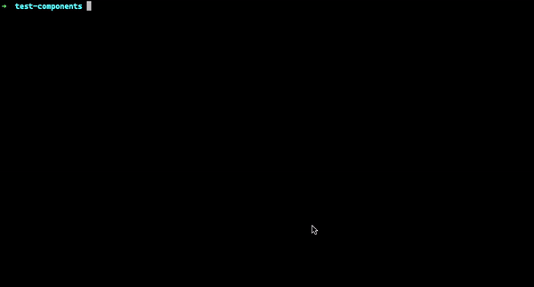

I love to automate any repetitive task 😍. That is what excites me in
programming. Sometimes I would spend more time in creating the automation than I
would use it for. For any large project, I would come up with a template of how
the components should look like. Then I would create a tool to generate those
templates. It would give consistency across the team and save some time.

Today will show you how to build one such tool.



This CLI dev tool, we should be able to create a component. We should be able to
customize the generated component with some options.

Let’s list down the features we would like in this CLI tool.

### What we want?

- Add options to name the component
- Option add files like utility, test files
- Option to choose the location where the component would be created
- Ability to create the component from anywhere

Let’s start by creating a component. For templating, we will be using
[handlebars](https://handlebarsjs.com) and for CLI commands we will be using
[Plop](https://github.com/plopjs/plop).

To start with you can add this in any existing project or you can create a new
one by npm init. Create a folder called src and create a file named index.js in
it. Also, create a folder named templates in src.

Add plop as a dev dependency, npm install plop -D.

To run the component generator, we will add a npm script to in `package.json`.
`"create-component": "plop --plopfile src/index.js"`.

Let’s us go through a bunch of commands for the same

```bash
npm init -y # if you don't have a project.

mkdir mkdir src templates
touch src/index.js
```

and in `package.json`:

```json
"scripts": {
    "create-component": "plop --plopfile src/index.js"
  },
```

While we are at it, let's create a template file `templates/component.hbs`. And
the content can be

```
import React from 'react';
import PropTypes from 'prop-types';

function {{ properCase name }}({ children }) {
  return <div>{children}</div>;
}

{{ properCase name }}.propTypes = {
  children: PropTypes.node,
};

{{ properCase name }}.defaultProps = {
  children: null,
};

export default {{ properCase name }};
```

If you notice we have used `name` and `properCase`. Here `name` is a variable
and `properCase` is a built in helpers provided by
[plop](https://github.com/plopjs/plop#built-in-helpers).

So let's create a plopfile where we ask our user to provide `name`.

```js
const componentGenerator = {
  description: "Add a React component",
  prompts: [
    {
      type: "input",
      name: "name",
      message: "What should it be called?",
      default: "Button",
    },
  ],
  actions: data => {
    const actions = [
      {
        type: "add",
        path: `{{properCase name}}/{{properCase name}}.component.jsx`,
        templateFile: "../templates/component.hbs",
        abortOnFail: true,
      },
    ]

    return actions
  },
}

module.exports = plop => {
  plop.setGenerator("component", componentGenerator)
}
```

Here we are creating a prompt `What should it be called?` and an action to
create file.

So lets run this, `npm run create-component`.

If everything goes well, it should have asked you `What should it be called?` If
you provide the name of the component, it create a folder named after the
component and file inside that. Yay 🥳!!!

Let's add some more features, like creating an utility file.

```js {10-15,27-34}
const componentGenerator = {
  description: "Add a React component",
  prompts: [
    {
      type: "input",
      name: "name",
      message: "What should it be called?",
      default: "Button",
    },
    {
      type: "confirm",
      name: "wantUtils",
      default: true,
      message: "Do you want utils?",
    },
  ],
  actions: data => {
    const actions = [
      {
        type: "add",
        path: `{{properCase name}}/{{properCase name}}.component.jsx`,
        templateFile: "../templates/component.hbs",
        abortOnFail: true,
      },
    ]

    if (data.wantUtils) {
      actions.push({
        type: "add",
        path: `${data.componentDir}/{{properCase name}}/{{properCase name}}.utilities.js`,
        templateFile: "./templates/component.utilities.hbs",
        abortOnFail: true,
      })
    }

    return actions
  },
}

module.exports = plop => {
  plop.setGenerator("component", componentGenerator)
}
```

Before we run the CLI again by `npm run create-component`, we have to create the
template `template/component.utilities.hbs`. I have kept the file empty for now.
Similarly we can prompt if we need test files and add options for that as well.
You may want add more options based on the project.

If you have noticed the component is always created at `src`, we might want to
create component any directory.

We can add `inquirer-select-directory` as dependency for the ability to select
the directory.

```js {7-12,21,33}
const promptDirectory = require("inquirer-select-directory")

const componentGenerator = {
  description: "Add an React component",
  prompts: [
    // ...
    {
      type: "directory",
      name: "componentDir",
      message: "Where you like to put this component?",
      basePath: "./",
    },
  ],
  actions: data => {
    data.username = gitUserName
    data.createdTime = new Date().toDateString()
    const actions = [
      //...
      {
        type: "add",
        path: `${data.componentDir}/{{properCase name}}/{{properCase name}}.component.jsx`,
        templateFile: "./templates/component.hbs",
        abortOnFail: true,
      },
    ]

    return actions
  },
}

module.exports = plop => {
  plop.setPrompt("directory", promptDirectory)
  plop.setGenerator("component", componentGenerator)
}
```

Here we are populating the location at `componentDir` and using it while
creating the component. Isn't that awesome? 🕺

We have to select the directory where we want the component to be generated
every time. It would be awesome if we can run this command from any location in
the filesystem like `gen MyAwesomeButton`.

**Let's do that!**

First we would have to create an executable script in `bin/index.js`.

```js
#!/usr/bin/env node

const path = require("path")

const plopFilePath = path.join(__dirname, "../src/index.js")
process.argv.push("--plopfile", plopFilePath)
const args = process.argv.slice(2)
const { Plop, run } = require("plop")
const argv = require("minimist")(args)

Plop.launch(
  {
    cwd: argv.cwd,
    configPath: argv.plopfile,
    require: argv.require,
    completion: argv.completion,
  },
  run
)
```

We have used `minimist` to extract arguments from the command. You also add it
by `npm install minimist -D`.

And in `package.json` let add this

```json {4-6}
"scripts": {
    "create-component": "plop --plopfile src/index.js"
  },
  "bin": {
    "gen": "bin/index.js"
  },
```

To make this available everywhere in yout system run `npm link .`

Voilà!!! 🥳🎊

I have created everything we did in a repo,
[component-generator](https://github.com/balavishnuvj/component-generator).
