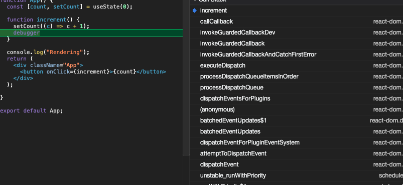

We update a state, React updates the DOM. Reacting to the state changes is what
React is about. DOM updates are expensive operations, they take a long time. So
if React updates the DOM every time there is a state update, our UI would be
sluggish. To overcome this, React batches these updates. Batching of states is
usually referred to as `async`. It comes from the official docs
"[State Updates May Be Asynchronous](https://reactjs.org/docs/state-and-lifecycle.html#state-updates-may-be-asynchronous)".
React does this as part of it's performance optimization strategy.

Let's dive in to see what happens when we update a state.

https://codesandbox.io/s/react-batched-single-b1n2h?file=/src/App.js&view=split

Open up the logs, and click the counter. You would see a log `Rendering` every
time you click the counter.

That is not surprising,🙆‍♂️? Let's add another `setState` in the handler. How many
times do think we would get `Rendering` this time?

https://codesandbox.io/s/react-batched-double-5qcp9?file=/src/App.js&view=split

It still gives you only one `Rendering` even though we are setting the state
twice. Yup, this is the performance optimization we were talking about. So, no
matter how many times we set the state in a single **tick** ✅ React would
render only once.

How does React know there is going to be a state update before it decides to
render? Let's add a debugger in our `increment` event handler.

That's interesting, we see `batchedEventUpdates` that is being called from
ReactDOM. If we look into React's source code, we see ReactDOM exports
[unstable_batchedUpdates](https://github.com/facebook/react/blob/4c7036e807fa18a3e21a5182983c7c0f05c5936e/packages/react-dom/index.stable.js#L12)
are used to batch all the updates. And If we dig a little deeper, we see that it
uses `Reconciler` to know which DOM node to be updated. Okay, you might be
thinking that's a bunch of code. A lot is going on in the source code. To be
honest, I don't understand most of it either. But when we poke around a little,
we get to know that React uses a `Scheduler` to time keep the updates.

So somewhere in the React source code, its wrapping all the updates in a
`batchedUpdates`. This is possible for React to do, because it knows the
handlers attached and it can wait for the "render" function to complete.
`batchedUpdates`could give React the states it needs to update for the next
render. This also means that everything outside the event loop (**the tick**),
React wouldn't be able to batch them.

To test that out, let's add an `async` handler and add `await` on something,
then update the state.

https://codesandbox.io/s/react-batched-async-xw5xu?file=/src/App.js

We have two updates before an await and two after. If you click on the counter
now, you will see three logs per click. That is because as discussed before,
React can batch state updates only if it knows all the states before hand that
has to be updated.

If we put an `await` in the handler, we set the state update sometime in the
future. Here, React can't batch updates as it doesnt know what all state update
it has to perform in this **tick**. So any updates after the `await`, React
would immediately flush those updates and render again.

This is true for anything that is updating the state outside React's "loop"
(scheduler). It could be `setTimeout`'s, `event handlers` (set directly to DOM
element) etc.

You can try all these cases in a single code sandbox.

https://codesandbox.io/s/react-dom-batched-updates-smerl?file=/src/App.js

_Original
[demo](https://codesandbox.io/s/react-dom-batched-updates-6b61f?file=/src/App.js)
was created by [Yago](https://twitter.com/yagopereiraaz)_

We have these kind of fun conversion on
[discord](https://discord.gg/GBeVchET).Join us if you want to be part of it.

Now we know that React render every time a state update is called after an async
operations. We can avoid it. If multiple states are related and they have to
updated together, use
[useReducer](https://reactjs.org/docs/hooks-reference.html#usereducer) instead
of [useState](https://reactjs.org/docs/hooks-reference.html#usestate)

### TL;DR;

React would batch your updates as long it happens in the same loop. State
updates after any async operation would make it to update the state immediately
(No batching).
