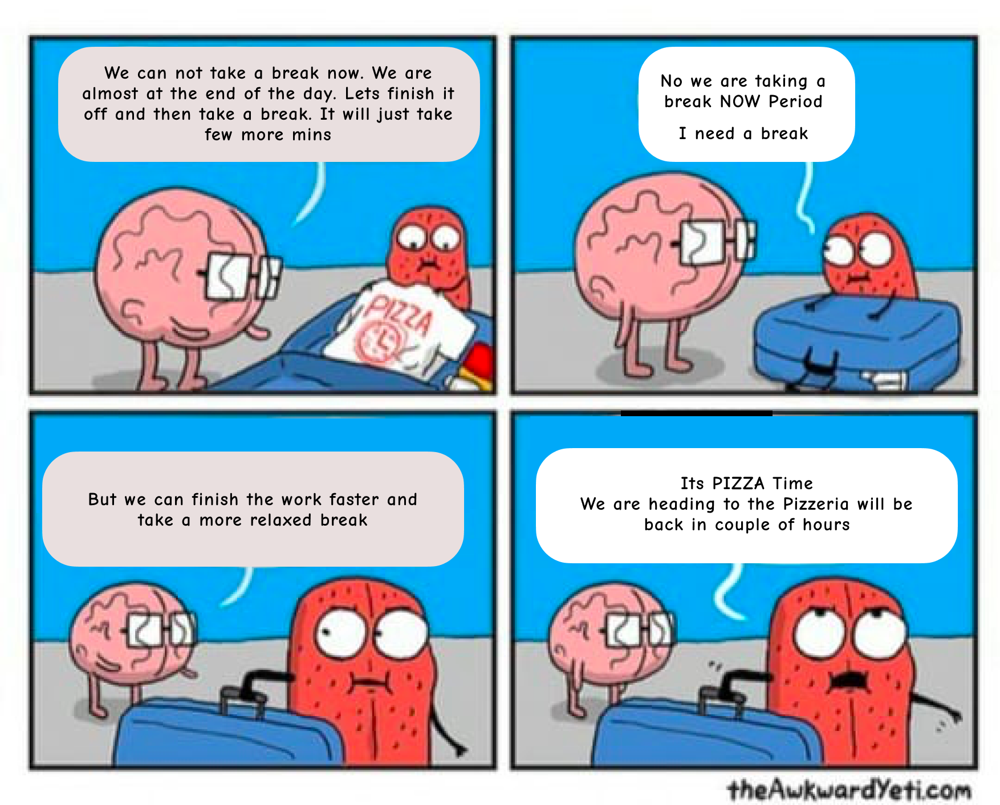

A few weeks back, I drove down 🚗 to my native with my parents and stayed there
doing nothing and just enjoying nature and catching up on my reading list. This
was the much-needed break that I realized when I came back to work.

It is February 2021, almost a year to work from home since the pandemic hit us.
A lot of us are facing some kind of burnout. It has also been difficult to
differentiate between work life and personal life. While we were working from an
office, commute to the office, the coffee break ☕️ or random chit-chat with
co-workers were some kinds of breaks. These used to our daily breaks. Now we
just schedule meetings, not breaks. ☹️

Recently, I was talking to one of the juniors from my work, that I had once
worked 40 hrs at a stretch. It wasn't a brag but warning him not to do such
silly things. I had a similar long working hour for a few weeks then. This had
affected my health, then had to take straight 2-3 days off to feel better. It
had help me to prioritize my health and personal life. I think I'm fortunate to
realize at the very beginning of my career, how important is it to take a break
from work and not to burn yourself.

When we are passionate about work, be it the product or the technology.
Sometimes even both. We often feel guilty to take breaks. We end up working late
hours to push that important feature or the interesting technical problem you
got to solve. It is okay to push yourself sometimes, but remind yourself to take
care of your health too.

Because we are so connected with the problem we want to solve, even on
vacations, we are mentally still back at work. I recommend when taking breaks
its best to cut yourself out from work to free up your mind and rejuvenate.

> “Each person deserves a day away in which no problems are confronted, no
> solutions searched for. Each of us needs to withdraw from the cares which will
> not withdraw from us.” – Maya Angelou

But what I would like to focus on further is identifying when to take a break.
To solve this problem for me I developed a system to define when and what type
of break I should be taking

## My Type of breaks:

- Short Break
- "Not so long" Break
- Long Break

### Short Break

The short break is a “short break” taken during your workday. It could be a 5-10
mins break or a small nap that could vary between 10 mins to 1 hr (or based on
your definition of short break). The purpose of a short break is to stop
thinking about the solution or problem. During this time, you take a walk,
daydream, snack, read, doodle, look at nature, exercise, call up family or
friends etc

**Confused about when should you be taking a short break?**

If you are taking double the time to finish the task or struggling to find
solutions to your problem or just finished an important task for the day or you
just spent 15 mins at a broken application because of a typo, it’s time for you
to take a short break.

**How to implement short breaks in your work schedule?**

There are multiple ways out there you could try, and mix-match based on your
requirements. I usually take a break for 5 minutes once in an hour or so.
Sometimes when I am in a flow of getting things done, I forget to take breaks
too. What I did often for a change of atmosphere is to go out of the room. Take
a walk in balcony or on the terrace.

### "Not so Long" Break

You should be taking at least a few hours of break from work once a week. You
could plan it after a major release. You could also plan it after continuously
working including the weekends over the week.

> “One day a week I seek to rest from earthly toil and sorrow. Revitalised, I
> find the strength to battle new tomorrows.” ― Richelle E. Goodrich

"Not so Long" Break could also be a weekend off where you are away from work not
checking emails or responding to queries or fixing small bugs. It is my
favourite as I get to do nothing and just relax. You just have to turn off your
system and relax. You could also plan for family movie time or dinner plans with
your friends or catch up on long-overdue binge-worthy TV series.

### Long Break 🎉🕺🥳

Long breaks are long-awaited breaks. It should be at least a week a year. This
requires you stepping out of the house and taking off from work. It is better to
let your team, friends and family know in advance when you are planning to take
a week off.

Long breaks are refreshing and when you come back you feel more passion towards
your work. It is difficult for us to take a week long vacation to some exotic
tourist destination. You could go to nearby place or visit family or relatives.
Please do take precautions and follow safety protocols by your government while
doing so.

So guys just remember, doesn’t matter what kind of break you are taking it, do
take a break and rejuvenate yourself.

**Go ahead a take a break, you deserve it! ❤️**
